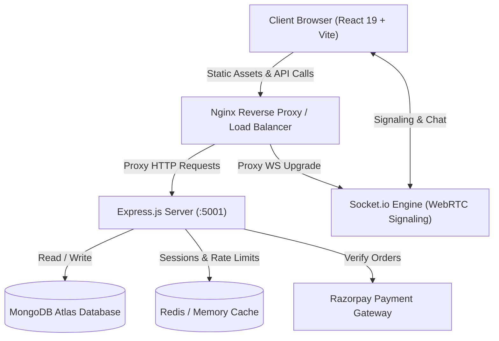

# 🚀 StreamHub — Full Stack Streaming, Learning & WebRTC SaaS Platform

[](https://nodejs.org/)
[](https://react.dev/)
[](https://expressjs.com/)
[](https://www.mongodb.com/)
[](https://webrtc.org/)
[](https://socket.io/)
[](LICENSE)

StreamHub is an authentic, production-grade video streaming, online learning, real-time WebRTC conferencing, and subscription SaaS platform. Built from the ground up with high performance, strict security, and clean architectural design patterns.

---

## ✨ Features

### 🎬 Video Streaming & Player
- **Adaptive Range Requests**: Stream videos via HTTP 206 Partial Content without downloading the entire media file.
- **Custom Player Controls**: Speed selector (0.5x - 2x), resolution picker, custom scrub progress bar, volume booster, and keyboard shortcuts.
- **Theater & Picture-in-Picture (PiP)**: Immersive viewing experience directly in the browser.
- **Watch History & Resume**: Seamlessly resumes playback from the exact second you left off across all devices.

### 📹 Real-Time WebRTC Meetings & Conferencing
- **HD Video & Audio**: Low-latency peer-to-peer audio and video streaming.
- **Screen Sharing**: Native screen casting with audio capture.
- **In-Room Chat & Hand Raising**: Interactive meeting collaboration with live participant presence.
- **Host Controls**: Meeting management, mute all, and room termination.

### 💳 Tiered Subscriptions & Razorpay Billing
- **Subscription Tiers**: Free, Pro ($19/mo), and Premium ($49/mo) plans.
- **Payment Verification**: Cryptographically verified Razorpay orders and webhook signature validation.
- **Automated Invoicing**: Dynamic HTML/PDF payment receipts and billing history.

### 💾 Offline Downloads & Quota Management
- **Tokenized Download Locks**: Ephemeral, encrypted download tokens preventing link sharing or bandwidth theft.
- **Tier-based Quotas**: Free (1/day), Pro (10/day), Premium (Unlimited) quota tracking and automated cron reset.

### 🛡️ Enterprise Security & Multi-Device Sessions
- **JWT + Refresh Token Rotation**: Secure, cookie-compatible authentication flow.
- **Device Fingerprinting**: Hardware fingerprint detection, trusted device management, and OTP anomaly challenges.
- **Audit Logs**: Immutable activity logging storing IP, User-Agent, and operational outcomes.

### 👑 Comprehensive Admin Portal
- **Dashboard Analytics**: Real-time revenue charts, active subscriptions, viewer counts, and bandwidth metrics.
- **Content & User Moderation**: Video upload management, user role assignment, and comment flag moderation.

---

## 🛠️ Tech Stack

| Domain | Technology |
|---|---|
| **Frontend** | React 19, Vite 8, React Router 7, Lucide Icons, Context API |
| **Backend** | Node.js, Express.js (ES Modules), Mongoose, Socket.io |
| **Database** | MongoDB Atlas / Local MongoDB 7.0, Redis (with memory cache fallback) |
| **Payments** | Razorpay Node SDK & Webhook Verification |
| **Realtime** | Socket.io WebSockets, Native WebRTC MediaStream API |
| **Security** | Helmet, CORS, Express Rate Limit, Mongo Sanitize, Bcrypt, Crypto |
| **Testing** | Node.js Native Test Runner (`node:test`, `node:assert`) |
| **DevOps** | Docker, Docker Compose, Nginx Alpine, Render Blueprints |

---

## 🏗️ System Architecture



---

## 📂 Project Structure

```text
StreamHub/
├── backend/
│   ├── src/
│   │   ├── config/          # DB, Redis, Mail, Razorpay, Cloudinary config
│   │   ├── controllers/     # Route business handlers (12 controllers)
│   │   ├── middleware/      # Auth, Admin, Quota, Rate Limit, Upload guards
│   │   ├── models/          # 19 Mongoose Data Models
│   │   ├── routes/          # Express API route declarations
│   │   ├── seeders/         # Plans, Admin, and Sample Video seeders
│   │   ├── services/        # 18 Modular application services
│   │   ├── sockets/         # Meeting & Chat WebRTC signaling servers
│   │   ├── templates/       # Email & Receipt HTML templates
│   │   └── utils/           # Encryption, Quota, Logger, Token utilities
│   ├── server.js            # Server entrypoint with database initialization
│   └── package.json
│
├── frontend/
│   ├── src/
│   │   ├── components/      # Common, Video, Meetings, Admin, Profile, Billing
│   │   ├── context/         # Auth, Theme, Player, Meeting, Subscription Contexts
│   │   ├── hooks/           # useAuth, useMeeting, useWebRTC, useDownload, etc.
│   │   ├── pages/           # Admin, Auth, Dashboard, Meetings, Public, Videos
│   │   ├── routes/          # AppRoutes definition with Route guards
│   │   ├── services/        # Axios API clients for all endpoints
│   │   ├── socket/          # Socket.io client connections
│   │   ├── utils/           # Formatters, Parsers, Permissions, Constants
│   │   ├── App.jsx          # Root layout with Navbar and Footer
│   │   └── main.jsx         # App bootstrapping
│   ├── index.html
│   └── vite.config.js
│
├── tests/
│   ├── backend/             # Auth, Video, Subscription, Quota unit tests
│   ├── frontend/            # Component & Context integration tests
│   └── e2e/                 # Full user journey workflows
│
├── deployment/
│   ├── Dockerfile.backend   # Node.js Alpine production build
│   ├── Dockerfile.frontend  # Multi-stage Nginx production build
│   ├── nginx.conf           # Reverse proxy, caching & SPA routing
│   └── render.yaml          # Cloud deployment specification
│
├── docs/                    # Architecture and API documentation
├── docker-compose.yml       # Complete multi-container orchestration
└── package.json             # Root monorepo scripts
```

---

## 🚀 Quick Start & Installation

### 1. Prerequisites
- **Node.js** v18+ (v20 Recommended)
- **npm** or **yarn**
- **MongoDB** (Local or MongoDB Atlas)

### 2. Clone and Setup
```bash
git clone https://github.com/your-username/streamhub.git
cd StreamHub
```

### 3. Install Dependencies
```bash
# Install root, backend, and frontend packages
npm run install:all
```

### 4. Configure Environment Variables
Copy `.env.example` to `backend/.env`:
```bash
cp .env.example backend/.env
```
*(Default Atlas MongoDB connection is pre-configured and ready to use out-of-the-box).*

### 5. Start Development Servers
```bash
# Start both backend and frontend concurrently
npm run dev
```
- **Frontend App**: `http://localhost:5173`
- **Backend API**: `http://localhost:5001`

---

## 🔑 Default Credentials

The platform automatically seeds essential database entities on initial startup:

| Role | Email | Password | Tier |
|---|---|---|---|
| **Administrator** | `admin@streamhub.com` | `AdminPassword123!` | Admin (All Features) |

---

## 🧪 Running Tests

The test suite covers backend models, authentication, video stream headers, quotas, and API controllers.

```bash
# Run backend test suite
npm test

# Run frontend tests
cd frontend && npm test
```

---

## 🐳 Docker Deployment

To launch the full stack (Frontend + Backend + MongoDB + Redis) using Docker Compose:

```bash
docker-compose up --build -d
```
Access the application at `http://localhost:80`.

---

## 📄 License

This project is licensed under the [MIT License](LICENSE).
